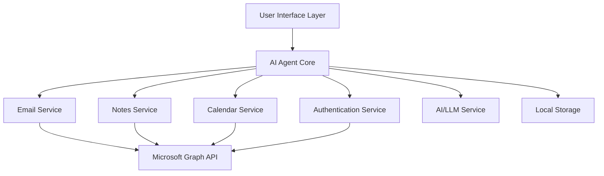

# Design Document: Outlook-OneNote AI Agent

## Overview

The Outlook-OneNote AI Agent is a desktop application that integrates with Microsoft 365 services to provide intelligent email management, note retrieval, and meeting assistance for Relationship Managers. The system uses Microsoft Graph API for data access, a local AI model or cloud-based LLM for natural language processing and analysis, and a lightweight user interface for interaction.

The agent operates as a background service that continuously monitors Outlook emails, analyzes their content, correlates them with OneNote entries, and surfaces relevant information to the user through a dashboard and conversational interface.

## Architecture

### High-Level Architecture



### Architecture Layers

1. **User Interface Layer**: Electron-based desktop application with a dashboard and chat interface
2. **Agent Core**: Orchestrates all services, manages workflows, and handles business logic
3. **Service Layer**: Specialized services for email, notes, calendar, and AI processing
4. **Integration Layer**: Microsoft Graph API client for accessing Microsoft 365 data
5. **Storage Layer**: Local SQLite database for caching and state management

### Technology Stack

- **Runtime**: Node.js (v18+)
- **UI Framework**: Electron with React for the frontend
- **Conversational UI**: CopilotKit for chat interface and actions (following DESIGN-002)
- **API Integration**: Microsoft Graph SDK for JavaScript
- **AI/LLM**: LLM Service with provider abstraction (following DESIGN-001)
  - Supports OpenAI, DeepSeek, Anthropic, Ollama
  - Includes caching and rate limiting
- **Database**: SQLite for local data storage
- **Authentication**: MSAL (Microsoft Authentication Library) for OAuth 2.0
- **Background Processing**: Node.js worker threads for continuous monitoring
- **State Management**: React Context + CopilotKit context

## Components and Interfaces

### 1. Authentication Service

**Responsibility**: Manages OAuth 2.0 authentication with Microsoft, token storage, and refresh.

**Key Methods**:
```typescript
interface IAuthenticationService {
  initialize(): Promise<void>;
  login(): Promise<AuthResult>;
  logout(): Promise<void>;
  getAccessToken(scopes: string[]): Promise<string>;
  refreshToken(): Promise<string>;
  isAuthenticated(): boolean;
}
```

**Implementation Details**:
- Uses MSAL Node for OAuth 2.0 flow
- Implements device code flow or interactive browser authentication
- Stores encrypted tokens in local secure storage (Windows Credential Manager / macOS Keychain)
- Required scopes: `Mail.Read`, `Notes.Read`, `Calendars.Read`, `User.Read`

### 2. Email Service

**Responsibility**: Monitors Outlook inbox, retrieves emails, and manages email-related operations.

**Key Methods**:
```typescript
interface IEmailService {
  startMonitoring(): Promise<void>;
  stopMonitoring(): Promise<void>;
  getRecentEmails(count: number): Promise<Email[]>;
  getEmailById(id: string): Promise<Email>;
  searchEmails(query: string): Promise<Email[]>;
  subscribeToChanges(callback: (email: Email) => void): void;
}
```

**Implementation Details**:
- Uses Microsoft Graph API `/me/messages` endpoint
- Implements delta queries for efficient change tracking
- Polls for new emails every 30 seconds (configurable)
- Supports webhook subscriptions for real-time updates (optional)
- Caches email metadata locally to reduce API calls

### 3. Notes Service

**Responsibility**: Accesses OneNote notebooks, searches for notes, and retrieves note content.

**Key Methods**:
```typescript
interface INotesService {
  getNotebooks(): Promise<Notebook[]>;
  searchNotes(query: string): Promise<Note[]>;
  getNoteContent(noteId: string): Promise<NoteContent>;
  findNotesByEntity(entityName: string, entityType: string): Promise<Note[]>;
}
```

**Implementation Details**:
- Uses Microsoft Graph API `/me/onenote` endpoints
- Implements full-text search across notebooks
- Extracts and parses HTML content from OneNote pages
- Caches notebook structure for faster navigation
- Supports semantic search using embeddings

### 4. Calendar Service

**Responsibility**: Manages calendar access, retrieves meetings, and provides scheduling assistance.

**Key Methods**:
```typescript
interface ICalendarService {
  getUpcomingMeetings(days: number): Promise<Meeting[]>;
  getMeetingById(id: string): Promise<Meeting>;
  findAvailableSlots(duration: number, days: number): Promise<TimeSlot[]>;
  getMeetingAttendees(meetingId: string): Promise<Attendee[]>;
}
```

**Implementation Details**:
- Uses Microsoft Graph API `/me/calendar` and `/me/events` endpoints
- Retrieves events with attendee information
- Calculates free/busy times for scheduling suggestions
- Supports recurring meeting detection

### 5. AI Service (LLM Service Pattern - DESIGN-001)

**Responsibility**: Provides natural language understanding, email analysis, and intelligent insights using the standardized LLM Service pattern.

**Key Methods**:
```typescript
interface IAIService {
  analyzeEmail(email: Email): Promise<EmailAnalysis>;
  extractEntities(text: string): Promise<Entity[]>;
  classifyPriority(email: Email): Promise<PriorityLevel>;
  generateSummary(content: string): Promise<string>;
  findSimilarNotes(text: string, notes: Note[]): Promise<RankedNote[]>;
  answerQuestion(question: string, context: Context): Promise<string>;
}
```

**Implementation Details** (following DESIGN-001):
- Uses **LLMService** with provider abstraction (OpenAI, DeepSeek, Anthropic, Ollama)
- Implements **CacheManager** for response caching (reduces costs and latency)
- Implements **RateLimiter** to prevent API rate limit issues
- Uses prompt engineering for email analysis and entity extraction
- Implements semantic similarity using embeddings (text-embedding-ada-002)
- Caches embeddings for notes to improve performance
- Configuration via environment variables:
  ```env
  LLM_PROVIDER=deepseek
  OPENAI_API_KEY=sk-...
  OPENAI_BASE_URL=https://api.deepseek.com
  OPENAI_MODEL=deepseek-chat
  ENABLE_CACHE=true
  CACHE_TTL=3600
  ```

**Example Usage**:
```typescript
// Initialize LLM Service
const llmService = new LLMService({
  provider: 'deepseek',
  apiKey: process.env.OPENAI_API_KEY,
  model: 'deepseek-chat',
  enableCache: true,
  cacheTTL: 3600,
});

// Analyze email
async analyzeEmail(email: Email): Promise<EmailAnalysis> {
  const response = await llmService.chat([
    { role: 'system', content: 'You are an email analysis assistant.' },
    { role: 'user', content: `Analyze this email: ${email.body}` },
  ]);
  return parseAnalysis(response.content);
}
```

### 6. Agent Core

**Responsibility**: Orchestrates all services, implements business logic, and manages workflows.

**Key Methods**:
```typescript
interface IAgentCore {
  start(): Promise<void>;
  stop(): Promise<void>;
  processNewEmail(email: Email): Promise<void>;
  handleUserQuery(query: string): Promise<AgentResponse>;
  getPriorityEmails(): Promise<Email[]>;
  getMeetingBriefing(meetingId: string): Promise<Briefing>;
  getInsights(): Promise<Insight[]>;
}
```

**Workflows**:

1. **Email Processing Workflow**:
   - Receive new email notification
   - Analyze email content with AI Service
   - Extract entities (clients, companies, projects)
   - Search for related notes in OneNote
   - Classify priority level
   - Store analysis results
   - Notify user if high priority

2. **Meeting Preparation Workflow**:
   - Detect upcoming meeting (24 hours before)
   - Retrieve meeting details and attendees
   - Search for notes about attendees
   - Find recent email communications with attendees
   - Generate meeting briefing
   - Present to user

3. **Query Response Workflow**:
   - Receive user question
   - Determine intent (search emails, find notes, schedule meeting, etc.)
   - Execute appropriate service calls
   - Aggregate results
   - Generate natural language response
   - Return with source references

### 7. Storage Service

**Responsibility**: Manages local data persistence, caching, and state management.

**Key Methods**:
```typescript
interface IStorageService {
  saveEmail(email: Email): Promise<void>;
  getEmail(id: string): Promise<Email | null>;
  saveAnalysis(emailId: string, analysis: EmailAnalysis): Promise<void>;
  getAnalysis(emailId: string): Promise<EmailAnalysis | null>;
  saveEmbedding(noteId: string, embedding: number[]): Promise<void>;
  getEmbedding(noteId: string): Promise<number[] | null>;
  clearCache(): Promise<void>;
}
```

**Implementation Details**:
- Uses SQLite for structured data storage
- Stores email metadata, analysis results, and embeddings
- Implements TTL (time-to-live) for cached data
- Provides query interface for historical data

### 8. User Interface (CopilotKit Pattern - DESIGN-002)

**Responsibility**: Provides conversational interface using CopilotKit for user interaction and information display.

**Architecture**:
```typescript
// App.tsx - Main Electron window
import { CopilotKit } from '@copilotkit/react-core';
import { CopilotChat } from '@copilotkit/react-ui';
import '@copilotkit/react-ui/styles.css';

export default function App() {
  return (
    <CopilotKit runtimeUrl="http://localhost:3001/copilotkit">
      <div className="app-container">
        <Dashboard />
        <CopilotChat
          labels={{
            title: 'Outlook-OneNote AI Assistant',
            initial: 'Hi! I can help you manage emails, find notes, and prepare for meetings.',
          }}
        />
      </div>
    </CopilotKit>
  );
}
```

**CopilotKit Actions** (following DESIGN-002):

1. **Email Actions**:
```typescript
useCopilotAction({
  name: 'getPriorityEmails',
  description: 'Get high-priority or due emails',
  parameters: [
    { name: 'limit', type: 'number', description: 'Max results', required: false },
  ],
  handler: async ({ limit = 10 }) => {
    const emails = await emailService.getPriorityEmails(limit);
    return `Found ${emails.length} priority emails`;
  },
});

useCopilotAction({
  name: 'searchEmails',
  description: 'Search emails by keyword, sender, or date',
  parameters: [
    { name: 'query', type: 'string', description: 'Search query', required: true },
  ],
  handler: async ({ query }) => {
    const results = await emailService.searchEmails(query);
    return `Found ${results.length} emails matching "${query}"`;
  },
});
```

2. **OneNote Actions**:
```typescript
useCopilotAction({
  name: 'searchNotes',
  description: 'Search OneNote for notes about a topic or person',
  parameters: [
    { name: 'query', type: 'string', description: 'Search query', required: true },
  ],
  handler: async ({ query }) => {
    const notes = await notesService.searchNotes(query);
    return `Found ${notes.length} notes about "${query}"`;
  },
});

useCopilotAction({
  name: 'getClientNotes',
  description: 'Get all notes related to a specific client',
  parameters: [
    { name: 'clientName', type: 'string', description: 'Client name', required: true },
  ],
  handler: async ({ clientName }) => {
    const notes = await notesService.findNotesByEntity(clientName, 'person');
    return `Found ${notes.length} notes about ${clientName}`;
  },
});
```

3. **Meeting Actions**:
```typescript
useCopilotAction({
  name: 'getUpcomingMeetings',
  description: 'Get upcoming meetings for the next N days',
  parameters: [
    { name: 'days', type: 'number', description: 'Number of days', required: false },
  ],
  handler: async ({ days = 7 }) => {
    const meetings = await calendarService.getUpcomingMeetings(days);
    return `You have ${meetings.length} meetings in the next ${days} days`;
  },
});

useCopilotAction({
  name: 'getMeetingBriefing',
  description: 'Get a briefing for an upcoming meeting with related notes and emails',
  parameters: [
    { name: 'meetingId', type: 'string', description: 'Meeting ID', required: true },
  ],
  handler: async ({ meetingId }) => {
    const briefing = await agentCore.getMeetingBriefing(meetingId);
    return formatBriefing(briefing);
  },
});
```

4. **Insight Actions**:
```typescript
useCopilotAction({
  name: 'getInsights',
  description: 'Get AI-powered insights and suggestions',
  parameters: [],
  handler: async () => {
    const insights = await agentCore.getInsights();
    return formatInsights(insights);
  },
});
```

**Context Management**:
```typescript
// Provide app context to CopilotKit
useCopilotReadable({
  description: 'Current user and authentication status',
  value: {
    isAuthenticated: authService.isAuthenticated(),
    userName: user?.name,
  },
});

useCopilotReadable({
  description: 'Recent email activity',
  value: {
    unreadCount: emailStats.unread,
    priorityCount: emailStats.priority,
    lastChecked: emailStats.lastChecked,
  },
});
```

**UI Components**:

1. **Dashboard View**:
   - Priority email list with highlights
   - Upcoming meetings with briefing links
   - Recent insights and suggestions
   - Quick action buttons

2. **CopilotKit Chat Interface** (built-in):
   - Natural language query input
   - Conversational responses with source links
   - Context-aware suggestions
   - Action execution with feedback

3. **Email Detail View**:
   - Email content display
   - Related notes panel (populated via CopilotKit action)
   - Priority indicators and tags
   - Action buttons (reply, schedule follow-up)

4. **Settings Panel**:
   - Authentication management
   - Notification preferences
   - Priority rules configuration
   - LLM provider selection
   - Data sync settings

## Data Models

### Email Model
```typescript
interface Email {
  id: string;
  subject: string;
  from: EmailAddress;
  to: EmailAddress[];
  cc?: EmailAddress[];
  body: string;
  receivedDateTime: Date;
  hasAttachments: boolean;
  importance: 'low' | 'normal' | 'high';
  isRead: boolean;
  conversationId: string;
}

interface EmailAddress {
  name: string;
  address: string;
}
```

### Email Analysis Model
```typescript
interface EmailAnalysis {
  emailId: string;
  priorityLevel: 'low' | 'medium' | 'high';
  priorityReason: string;
  entities: Entity[];
  actionItems: ActionItem[];
  sentiment: 'positive' | 'neutral' | 'negative';
  summary: string;
  suggestedResponse?: string;
  relatedNotes: Note[];
  deadline?: Date;
  analyzedAt: Date;
}

interface Entity {
  text: string;
  type: 'person' | 'company' | 'project' | 'location' | 'date';
  confidence: number;
}

interface ActionItem {
  description: string;
  dueDate?: Date;
  priority: 'low' | 'medium' | 'high';
}
```

### Note Model
```typescript
interface Notebook {
  id: string;
  displayName: string;
  sections: Section[];
}

interface Section {
  id: string;
  displayName: string;
  parentNotebookId: string;
}

interface Note {
  id: string;
  title: string;
  content: string;
  createdDateTime: Date;
  lastModifiedDateTime: Date;
  sectionId: string;
  notebookId: string;
  tags: string[];
}

interface NoteContent {
  html: string;
  plainText: string;
  images: Image[];
}
```

### Meeting Model
```typescript
interface Meeting {
  id: string;
  subject: string;
  start: Date;
  end: Date;
  location?: string;
  organizer: EmailAddress;
  attendees: Attendee[];
  body: string;
  isOnlineMeeting: boolean;
  onlineMeetingUrl?: string;
}

interface Attendee {
  emailAddress: EmailAddress;
  type: 'required' | 'optional' | 'resource';
  status: 'none' | 'accepted' | 'declined' | 'tentative';
}

interface Briefing {
  meeting: Meeting;
  attendeeNotes: Map<string, Note[]>;
  recentEmails: Email[];
  suggestedTopics: string[];
  generatedAt: Date;
}
```

### Insight Model
```typescript
interface Insight {
  id: string;
  type: 'follow_up' | 'deadline' | 'pattern' | 'suggestion';
  title: string;
  description: string;
  priority: 'low' | 'medium' | 'high';
  actionable: boolean;
  relatedItems: RelatedItem[];
  createdAt: Date;
}

interface RelatedItem {
  type: 'email' | 'note' | 'meeting';
  id: string;
  title: string;
}
```

## Error Handling

### Error Categories

1. **Authentication Errors**:
   - Token expiration: Automatically refresh token
   - Invalid credentials: Prompt user to re-authenticate
   - Insufficient permissions: Display required scopes and request consent

2. **API Errors**:
   - Rate limiting (429): Implement exponential backoff
   - Network errors: Retry with exponential backoff (max 3 attempts)
   - Service unavailable (503): Queue requests and retry later
   - Not found (404): Log and skip item

3. **AI Service Errors**:
   - API quota exceeded: Fall back to basic analysis without AI
   - Invalid response: Log error and return default analysis
   - Timeout: Cancel request and retry with shorter timeout

4. **Storage Errors**:
   - Database locked: Retry with delay
   - Disk full: Alert user and suggest cleanup
   - Corruption: Rebuild database from cache

### Error Handling Strategy

```typescript
interface ErrorHandler {
  handleError(error: Error, context: ErrorContext): Promise<ErrorResolution>;
  logError(error: Error, context: ErrorContext): void;
  notifyUser(error: Error, severity: 'info' | 'warning' | 'error'): void;
}

interface ErrorResolution {
  retry: boolean;
  fallback?: () => Promise<any>;
  userAction?: string;
}
```

### Logging

- Use structured logging with levels: DEBUG, INFO, WARN, ERROR
- Log all API calls with request/response metadata
- Log authentication events
- Store logs locally with rotation (max 7 days)
- Provide log export for troubleshooting

## Testing Strategy

### Unit Tests

**Coverage Areas**:
- Authentication service token management
- Email service API interactions (mocked)
- Notes service search and retrieval (mocked)
- AI service entity extraction and classification
- Storage service CRUD operations
- Agent core workflow logic

**Tools**: Jest, ts-jest

**Approach**:
- Mock Microsoft Graph API responses
- Mock AI service responses
- Test error handling paths
- Test edge cases (empty results, malformed data)

### Integration Tests

**Coverage Areas**:
- End-to-end email processing workflow
- Meeting briefing generation
- User query handling
- Authentication flow with test tenant

**Tools**: Jest, Playwright for UI testing

**Approach**:
- Use Microsoft Graph API test tenant
- Test with sample emails and notes
- Verify data flow between services
- Test UI interactions

### Manual Testing Scenarios

1. **Email Monitoring**:
   - Send test emails with various priority levels
   - Verify correct classification and notification
   - Test with emails containing deadlines

2. **Note Retrieval**:
   - Create test notes in OneNote
   - Query for notes using natural language
   - Verify correct note retrieval and ranking

3. **Meeting Preparation**:
   - Schedule test meetings
   - Verify briefing generation 24 hours before
   - Check related notes and emails are included

4. **Authentication**:
   - Test initial login flow
   - Test token refresh
   - Test re-authentication after logout

### Performance Testing

**Metrics to Monitor**:
- Email processing time (target: < 2 seconds per email)
- Note search response time (target: < 1 second)
- UI responsiveness (target: < 100ms for interactions)
- Memory usage (target: < 500MB)
- API call efficiency (minimize redundant calls)

**Tools**: Artillery for load testing, Chrome DevTools for profiling

## Security Considerations

### Authentication Security

- Use MSAL library for OAuth 2.0 (industry standard)
- Store tokens in OS-level secure storage (encrypted)
- Implement token refresh before expiration
- Support multi-factor authentication (MFA)
- Clear tokens on logout

### Data Security

- Encrypt sensitive data at rest (SQLite encryption)
- Use HTTPS for all API communications
- Implement certificate pinning for Graph API
- Sanitize user inputs to prevent injection attacks
- Implement rate limiting for AI API calls

### Privacy

- Store minimal data locally (only metadata and analysis)
- Provide data export and deletion options
- Clear cache on user request
- Do not send email content to third-party services without consent
- Implement opt-in for AI features

### Compliance

- Follow Microsoft Graph API best practices
- Respect user's Microsoft 365 data retention policies
- Implement audit logging for data access
- Provide transparency about data usage

## CopilotKit Runtime Setup

**Backend Server** (runs alongside Electron app):

```javascript
// server/index.js
import express from 'express';
import { CopilotRuntime, OpenAIAdapter, copilotRuntimeNodeHttpEndpoint } from '@copilotkit/runtime';
import { LLMService } from './services/llm-service.js';
import { llmConfig } from './config/llm-config.js';

const app = express();

// Initialize LLM Service (DESIGN-001)
const llmService = new LLMService(llmConfig);

// Create CopilotKit adapter
const serviceAdapter = new OpenAIAdapter({
  model: llmConfig.model,
  openai: llmService.provider.client, // Use our LLM client
});

// Create runtime
const runtime = new CopilotRuntime();

// Mount CopilotKit endpoint
app.use(
  '/copilotkit',
  copilotRuntimeNodeHttpEndpoint({
    endpoint: '/copilotkit',
    runtime,
    serviceAdapter,
  })
);

// Start server
const PORT = 3001;
app.listen(PORT, () => {
  console.log(`✅ CopilotKit runtime running on http://localhost:${PORT}`);
});
```

**Integration with Electron**:
- Backend server starts automatically when Electron app launches
- Server runs on localhost:3001
- Frontend connects via CopilotKit provider
- Server shuts down when Electron app closes

## Deployment and Configuration

### Installation

- Distribute as Electron application (Windows, macOS, Linux)
- Installer includes all dependencies (Node.js runtime, backend server)
- First-run wizard for authentication and configuration
- Backend server auto-starts with Electron app

### Configuration Options

**Environment Variables** (following DESIGN-001):
```env
# LLM Provider Configuration
LLM_PROVIDER=deepseek
OPENAI_API_KEY=sk-...
OPENAI_BASE_URL=https://api.deepseek.com
OPENAI_MODEL=deepseek-chat

# LLM Performance
ENABLE_CACHE=true
CACHE_TTL=3600
MAX_REQUESTS_PER_MINUTE=60
MAX_TOKENS=1000
TEMPERATURE=0.7

# Microsoft Graph API
MICROSOFT_CLIENT_ID=your-client-id
MICROSOFT_TENANT_ID=common
MICROSOFT_REDIRECT_URI=http://localhost:3000/auth/callback

# Application Settings
POLL_INTERVAL=30
ENABLE_WEBHOOKS=false
ENABLE_NOTIFICATIONS=true
```

**Application Config** (config.json):
```json
{
  "monitoring": {
    "pollInterval": 30,
    "enableWebhooks": false
  },
  "notifications": {
    "enabled": true,
    "highPriorityOnly": false,
    "sound": true
  },
  "ai": {
    "provider": "deepseek",
    "model": "deepseek-chat",
    "enableCache": true,
    "cacheTTL": 3600
  },
  "priority": {
    "vipSenders": ["client@example.com"],
    "urgentKeywords": ["urgent", "asap", "deadline"],
    "autoMarkImportant": true
  },
  "storage": {
    "cacheDuration": 7,
    "maxCacheSize": 1000
  },
  "copilotkit": {
    "runtimeUrl": "http://localhost:3001/copilotkit",
    "enableStreaming": true
  }
}
```

### Updates

- Implement auto-update mechanism (Electron auto-updater)
- Check for updates on startup
- Notify user of available updates
- Support manual update check

## MVP vs Full Version

### MVP (Electron Desktop App)

The MVP focuses on core functionality delivered as a standalone Electron desktop application:

**Included Features**:
- Email monitoring and prioritization
- OneNote note search and retrieval
- Email-note correlation
- Meeting briefing generation
- Basic AI-powered insights
- Dashboard UI with priority emails
- Chat interface for queries
- OAuth authentication

**Benefits**:
- Full control over UI and UX
- Background processing capabilities
- Rich desktop notifications
- Faster development cycle
- No Outlook version dependencies

### Future Version (Outlook Add-in)

After MVP validation, develop an Outlook Add-in version for deeper integration:

**Architecture Changes**:
- Built using Office.js API framework
- Runs in Outlook task pane
- Direct access to current email context
- Shared backend service with Electron version

**Additional Benefits**:
- Embedded directly in Outlook interface
- Automatic context awareness (current email)
- No separate app to launch
- Works across Outlook platforms (Windows, Mac, Web, Mobile)
- Can use Outlook UI components

**Implementation Approach**:
- Reuse core services (Email, Notes, Calendar, AI, Storage)
- Create new UI layer using Office Add-in framework
- Deploy via Microsoft AppSource or organization catalog
- Maintain Electron version for users who prefer standalone app

## Future Enhancements

1. **Outlook Add-in Version**: Embedded version that runs inside Outlook (post-MVP)
2. **CRM Integration**: Connect with Salesforce, Dynamics 365, or other CRM systems
3. **Email Drafting**: AI-powered email composition and response suggestions
4. **Voice Interface**: Voice commands for hands-free operation
5. **Mobile App**: Companion mobile app for on-the-go access
6. **Team Collaboration**: Share insights and notes with team members
7. **Advanced Analytics**: Dashboard with relationship management metrics
8. **Custom Workflows**: User-defined automation rules and triggers
9. **Multi-language Support**: Support for non-English emails and notes
10. **Browser Extension**: Lightweight version for web-based access

## Design Pattern References

This design follows established patterns from previous projects:

- **[DESIGN-001: LLM Server Integration](../.kiro/specs/DESIGN-001-LLM-Server-Integration.md)**
  - LLM Service with provider abstraction
  - Cache Manager for cost optimization
  - Rate Limiter for API protection
  - Support for multiple providers (OpenAI, DeepSeek, Anthropic, Ollama)

- **[DESIGN-002: CopilotKit UI Integration](../.kiro/specs/DESIGN-002-CopilotKit-UI-Integration.md)**
  - CopilotKit for conversational UI
  - Custom actions for app-specific functionality
  - Context management for AI awareness
  - CopilotKit Runtime backend setup

These patterns ensure consistency, maintainability, and proven architecture across projects.
